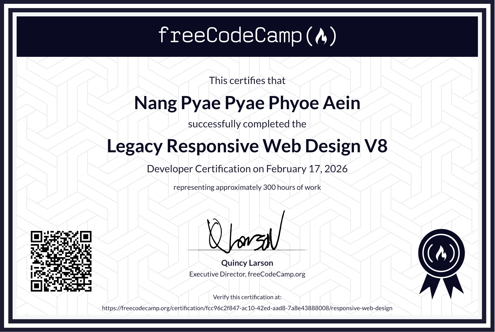

# Responsive Web Design Certification (freeCodeCamp)

  

# Lessons Learned

Through this Responsive Web Design course, I gained practical experience in building responsive web pages using HTML and CSS. I learned how to structure layouts with Flexbox and CSS Grid, apply media queries for different screen sizes, and implement fixed navigation for better usability. This course helped me understand how responsive design improves accessibility and user experience across devices.
